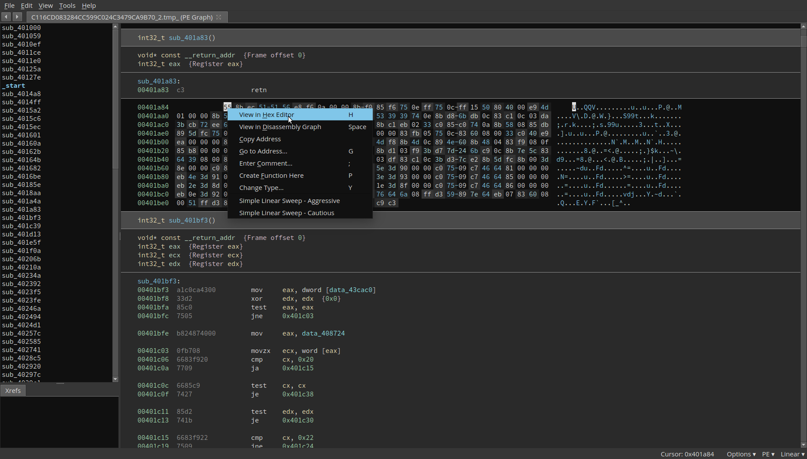
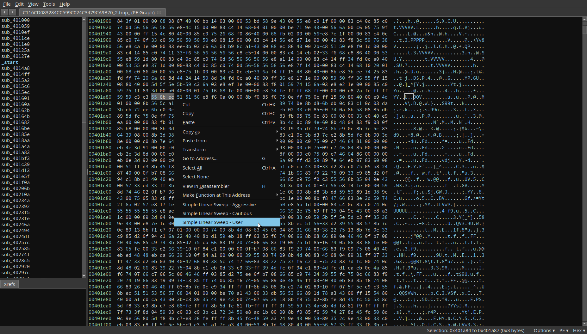
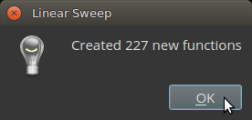

# Simple Linear Sweep for BinaryNinja
Author: **butters**

_A simple linear sweep for x86 and x86_64._

## Description:

This plugin is a temporary solution until a linear sweep is included in core. It identifies functions by searching for common prologues and makes an attempt to avoid some false positives by analysing the created function. 

There are three modes, Cautious, Aggressive and User.

#### Cautious:
Analyzes the first 3 bytes of all existing functions and then uses the most common values as prologues for additional function searching within the bounds of the .text section, if it is defined.

#### Aggressive:
Performs the Cautious analysis and also searches the entire binary for a list of common prologues.
 
#### User:
If during analysis you want to search for a specific prologue only, switch to the hex editor at the appropriate location.




Select the bytes you want to search for and through the right-click menu, select Simple Linear Sweep - User.




The selected bytes will be used for a prologue search.



## Instalation:

To install this plugin, navigate to your Binary Ninja plugins directory, and run

```git clone https://github.com/lstotch/binaryninja-linsweep.git linsweep```

## Minimum Version

This plugin requires the following minimum version of Binary Ninja:

 * release (Commercial) - 1.0.729-dev
 * release (Personal) - 1.0.729-dev

## License

This plugin is released under a [MIT](LICENSE) license.

